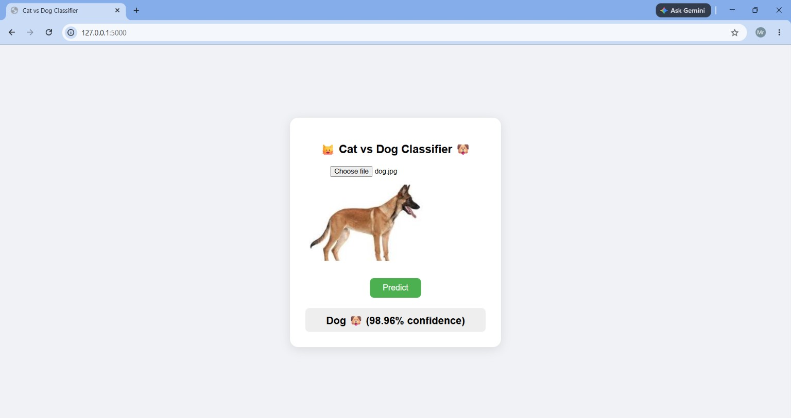

# 🐶 Cat vs Dog Image Classifier 🐱

A web app that looks at a picture and tells you if it's a cat or a dog. Built using a neural network I trained myself, with a simple website on top so anyone can upload a photo and try it out.



## 🧠 What This Project Does

You upload a photo of a cat or dog, and the app tells you which one it is, along with how confident it is (like "Dog 🐶 - 92% sure").

Behind the scenes, I trained a CNN (a type of neural network good at recognizing images) on 25,000 cat and dog photos from [this Kaggle dataset](https://www.kaggle.com/datasets/salader/dogsvscats). The website is built with Flask (Python), and a simple HTML page lets you upload images and see results.

## 🛠️ Tools I Used

|       What         |Tool                  |
|---                 |---                   |
| Training the model | TensorFlow / Keras   |
| Website backend    | Flask (Python)       |
| Website frontend   | HTML, CSS, JavaScript|
| Dataset            | Kaggle - Dogs vs Cats|

## 🏗️ How It Works (Step by Step)

1. You upload a photo on the website
2. The photo gets sent to the backend
3. The backend resizes the photo and prepares it the way the model expects
4. The trained model looks at it and predicts cat or dog
5. The result shows up on screen with a confidence percentage

## 📊 How the Model Is Built

- 3 layers that scan the image for patterns (edges, shapes, textures)
- Layers in between that shrink the image down while keeping the important parts
- A final layer that makes the actual cat-or-dog decision

## ⚠️ About the Model File

The trained model file is about 360MB, which is too big to upload directly to GitHub. So it's not included in this repo. If you want to run this project yourself, you can either:
- Train your own model using the same steps, or
- Grab the trained model from [Hugging Face](https://huggingface.co/Ritesh753/cat-dog-classifier) and drop it into the project folder

## 🚀 How to Run This on Your Own Laptop

```bash
# Download the code
git clone https://github.com/Ritesh753/cat-dog-classifier.git
cd cat-dog-classifier

# Set up a Python environment
python -m venv venv
venv\Scripts\Activate.ps1      # for Windows

# Install what the project needs
pip install -r requirements.txt

# Add cat_dog_model.keras to this folder (see note above)

# Start the app
python app.py
```

Then open `http://127.0.0.1:5000` in your browser and try it out.

## 📁 What's Inside This Folder

```
cat-dog-classifier/
├── app.py                  # The Flask backend
├── requirements.txt        # List of things Python needs to install
├── templates/
│   └── index.html          # The webpage itself
└── cat_dog_model.keras     # The trained model (not included, see note above)
```

## 📚 What I Learned Doing This

- How to build and train a CNN from scratch to recognize images
- How to clean and prepare a large set of images for training
- How to build a simple API with Flask so a website can talk to the model
- How to connect a webpage to a backend using JavaScript
- How to use Git and GitHub properly, including dealing with large files
- Got hands-on with cloud deployment (Render) and hosting models on Hugging Face

## 🙋 About Me

Third-year B.Tech student, learning AI/ML by building real projects alongside my coursework.
